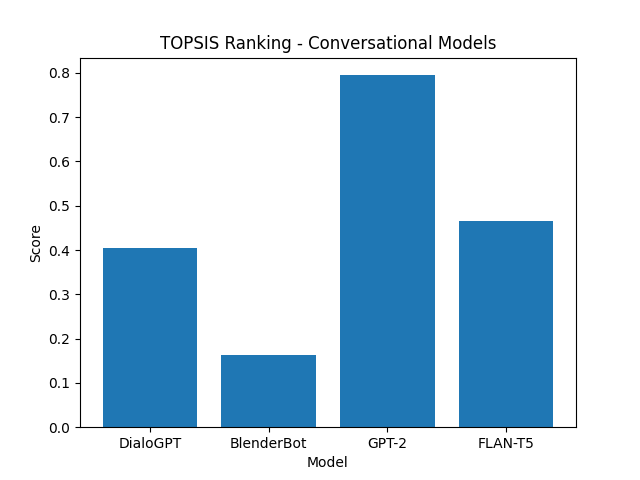

# TOPSIS Assignment – Conversational Models

## 📌 Task

Apply **TOPSIS** to find the best **pre-trained conversational model**.

---

## 🤖 Models Used

* DialoGPT
* BlenderBot
* GPT-2
* FLAN-T5

---

## 📊 Criteria Used

* Accuracy **(+)**
* Inference Time **(-)**
* Model Size **(-)**
* Memory Usage **(-)**

**Weights:** `[0.4, 0.2, 0.2, 0.2]`

---

## 📈 Results (Tables & Graphs)

### ✔ Result Table

The TOPSIS scores and ranking of models are saved in:

```
result.csv
```

This table shows the calculated score and final rank of each conversational model.


### ✔ Graph Visualization

The comparison graph generated from TOPSIS scores is shown below:




The graph visually compares all models based on their TOPSIS score to help identify the best model.

---

## ▶️ How to Run

Install libraries:

```
pip install -r requirements.txt
```

Run TOPSIS:

```
python topsis.py
```

Generate graph:

```
python plot.py
```

---

## 📁 Files

* `data.csv` – dataset
* `topsis.py` – TOPSIS implementation
* `plot.py` – graph generation
* `result.csv` – output table
* `graph.png` – visualization

---

**Author:** Manmeet
