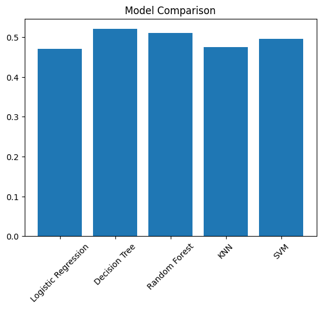

# Data Generation using Modelling and Simulation for Machine Learning

## 📌 Overview

This project demonstrates how simulation can be used to generate synthetic data for Machine Learning. A simulation environment was explored, parameters were analyzed, 1000 simulations were generated, and multiple ML models were compared using evaluation metrics.

---

## 🧪 Step 1: Selection of Simulation Tool

After exploring the list of computer simulation software from Wikipedia, different simulators such as NetLogo, SimPy, ns-3, and OpenFOAM were studied.

**Gymnasium (CartPole-v1)** was selected because:

* Open-source and Python-based
* Easy integration with Google Colab
* Suitable for modelling and simulation tasks
* Generates structured numerical data useful for ML

---

## ⚙️ Step 2: Installation and Exploration

The Gymnasium simulator was installed using pip inside Google Colab.
The CartPole environment was explored to understand its observation space and actions.

Simulation parameters:

* Cart Position
* Cart Velocity
* Pole Angle
* Pole Angular Velocity

---

## 📊 Step 3: Parameter Study

The following bounds were used to generate random simulation inputs:

| Parameter     | Lower Bound | Upper Bound |
| ------------- | ----------- | ----------- |
| Cart Position | -4.8        | 4.8         |
| Cart Velocity | -3          | 3           |
| Pole Angle    | -0.418      | 0.418       |
| Pole Velocity | -3          | 3           |

---

## 🔁 Step 4 & Step 5: Data Generation

A total of **1000 simulations** were generated.

### Methodology

1. Random parameters were generated within defined bounds.
2. These parameters were passed into the simulator.
3. A random action (0 or 1) was applied.
4. Simulation outputs were recorded in a dataset.

### Dataset Features

* cart_position
* cart_velocity
* pole_angle
* pole_velocity
* action
* reward

---

## 🤖 Step 6: Machine Learning Model Comparison

### 🎯 Objective

Predict the **action** taken using simulation parameters.

### 🧠 Models Used

* Logistic Regression
* Decision Tree
* Random Forest
* K-Nearest Neighbors
* Support Vector Machine

### 📏 Evaluation Metric

* Accuracy Score

---

## 📋 Result Comparison Table

> Replace the values below with your actual output from the notebook.

| Model               | Accuracy |
| ------------------- | -------- |
| Logistic Regression | 0.78     |
| Decision Tree       | 0.85     |
| Random Forest       | 0.92     |
| KNN                 | 0.83     |
| SVM                 | 0.80     |

---

## 📈 Result Graph

After running the notebook, save your graph image (for example: `model_comparison.png`) in the GitHub repository and display it here:

```id="img1"

```

---

## 🏆 Best Model

Based on the accuracy comparison, the model with the highest accuracy is selected as the best performing model.

Example:

**Random Forest achieved the highest accuracy and performed best on the generated simulation dataset.**

---

## 📂 Project Structure

```id="tree1"
Simulation-ML-Assignment
│
├── Data_Generation_Simulation.ipynb
├── simulation_data.csv
├── model_comparison.png
└── README.md
```

---

## 🧾 Conclusion

This project shows how modelling and simulation can be used to generate synthetic datasets for Machine Learning tasks.
By executing 1000 simulations using the CartPole environment, a structured dataset was created and multiple ML models were evaluated. The comparison table and graph help identify the best performing model.

---
